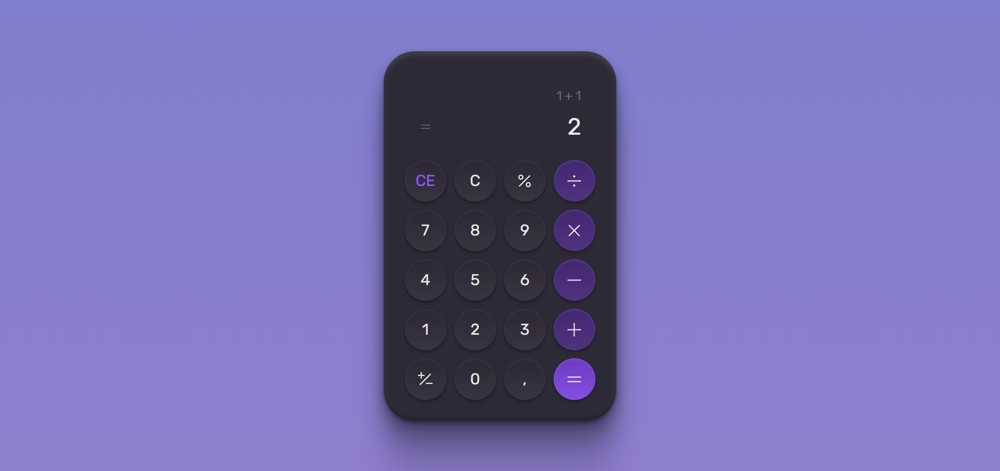

<h1 align="center">CALCULATOR</h1>

Um projeto criado para treinar o meu conhecimento como Front-End

<h3>O projeto foi realizado com as ferramentas:</h3>

<ul>
<li>HTML</li>
</ul>

<ul>
<li>CSS</li>
</ul>
 

 

<h3>Link do projeto</h3>
<a href="https://calculator-kaiokaled.netlify.app/">CALCULATOR</a>
